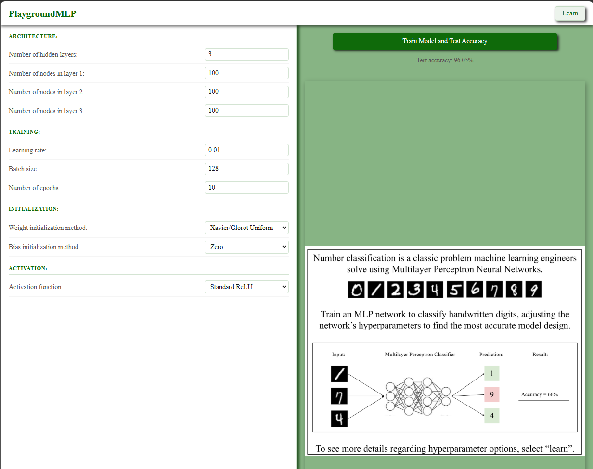
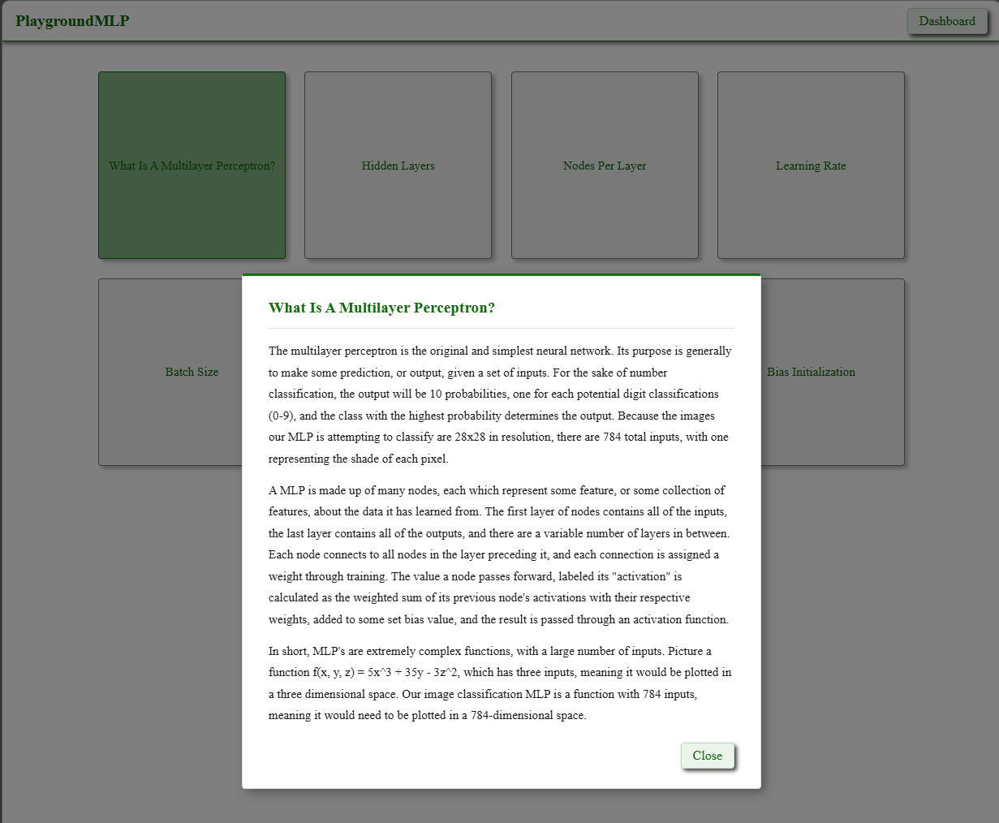

# PlaygroundMLP

A browser-based sandbox for experimenting with multilayer perceptron hyperparameters on a real classification task. Configure your network architecture, training settings, and initialization strategy, then train it against the MNIST handwritten digit dataset and see the resulting test accuracy — no setup, no install, just open the page.

---

## What It Does

The dashboard exposes every major MLP hyperparameter as a configurable input: number of hidden layers, nodes per layer, learning rate, batch size, epochs, weight initialization method, and bias initialization method. Hit "Train Model and Test Accuracy" and the network trains in-browser via TensorFlow.js, reporting live epoch progress and a final test accuracy percentage.

The learn section is a reference companion. Each hyperparameter has a dedicated popup that explains what it controls, why it matters, and how different choices affect training. Buttons track which topics you have already visited within a session.





---

## Dependencies

This project has no local dependencies to install. Everything runs in the browser.

- **TensorFlow.js** — loaded from CDN (`cdn.jsdelivr.net/npm/@tensorflow/tfjs@latest`). Handles model construction, training, and evaluation entirely client-side.
- **MNIST data** — fetched and processed by `mnist.js` at training time.

---

## How to Run

Because `dashboard.js` uses ES module imports, the page must be served over HTTP rather than opened directly as a `file://` URL. The simplest way is a local static server.

**Using Python (built-in):**

```
python -m http.server 8080
```

Then open `http://localhost:8080` in your browser. The root `index.html` redirects automatically to the dashboard.

**Using the VS Code Live Server extension:**

Right-click `index.html` and select "Open with Live Server".

---

## Project Structure

```
PlaygroundMLP/
  index.html              -- redirects to the dashboard
  Dashboard/
    dashboard.html        -- main UI with hyperparameter controls
    dashboard.js          -- input handling and train button logic
    network.js            -- TensorFlow.js model construction and training
    mnist.js              -- MNIST data loading and preprocessing
    dashboard.css
  Learn/
    learn.html            -- hyperparameter reference page
    learn.js              -- popup content and session-based visited tracking
    learn.css
  images/
    PlaygroundMLP domain explanation.png
```
